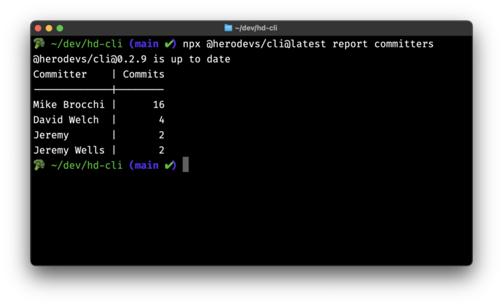

# Git Audit

Get a list of committers in a project.



## Installation

Follow the instructions [here](installation-and-running.md) to install the HeroDevs CLI.

## Running

```bash
hdcli report committers
```

## Options

The options available for the committers report allow for fine-grained control of the data.

```bash
hdcli report committers [options]
```

`--startDate`
alias: -s
default: format(new Date(), dateFormat),
describe: `Start Date (format: ${dateFormat})`,
string: true,

`--endDate`
alias: -e
describe: `End Date (format: ${dateFormat})`,
required: false,
default: format(subMonths(new Date(), monthsToSubtract), dateFormat),

`--exclude`
alias: -x
array: true,
describe: 'Path Exclusions (eg -x="./src/bin" -x="./dist")',
required: false,

`--json`
describe: 'Output to JSON format',
required: false,
default: false,
boolean: true,
